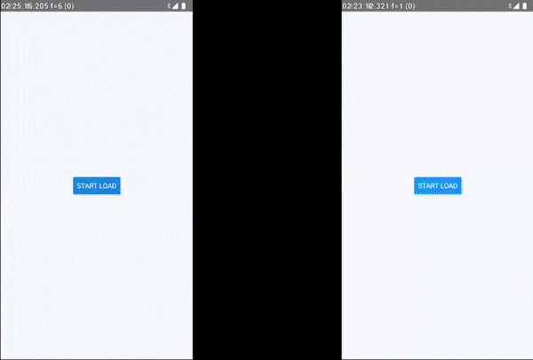

# react-native-cronet: Chrome's networking stack for your react-native application

[](http://makeapullrequest.com)
[](https://github.com/akshetpandey/react-native-cronet)
[](https://snyk.io/test/github/akshetpandey/react-native-cronet)
[](https://www.npmjs.com/package/react-native-cronet)

[Cronet](https://chromium.googlesource.com/chromium/src/+/master/components/cronet) is the [networking stack of Chromium](https://chromium.googlesource.com/chromium/src/+/master/net/docs/life-of-a-url-request.md) put into a library for use on mobile.
This is the same networking stack that is used in the Chrome browser by over a billion people.
It offers an easy-to-use, high performance, standards-compliant, and secure way to perform HTTP requests.
Cronet has support for both Android and iOS.

This module allows you to use the Cronet stack for your react native apps.
Checkout default react-native vs react-native-cronet comparison on android when loading many images on a high lateceny and packetloss network



## Support Matrix

| React Native | react-native-cronet |
| :----------: | :-----------------: |
|    >=0.62    |        0.5.0        |
|    >=0.60    |        0.4.0        |
|    <0.60     |     unsupported     |

## Getting started

Using npm:

```shell
npm install --save react-native-cronet
```

or using yarn:

```shell
yarn add react-native-cronet
```

### Automatic installation

`react-native-cronet` will link automatically using the autolink.

Make sure to run `pod install` in your iOS folder to get the `Cronet.framework` dependency included.

### Manual installation

#### iOS

1. In XCode, in the project navigator, right click `Libraries` ➜ `Add Files to [your project's name]`
2. Go to `node_modules` ➜ `react-native-cronet` and add `RNCronet.xcodeproj`
3. In XCode, in the project navigator, select your project. Add `libRNCronet.a` to your project's `Build Phases` ➜ `Link Binary With Libraries`
4. Add `pod 'Cronet'` as a dependency in your iOS `Podfile` and run `pod install`, alternatively manaually link [Cronet.framework](https://github.com/akshetpandey/Cronet.framework/releases/latest) to your project
5. Run your project (`Cmd+R`)<

#### Android

1. Open up `android/app/src/main/java/[...]/MainApplication.java`

- Add `import com.akshetpandey.rncronet.RNCronetPackage;` to the imports at the top of the file
- Add `new RNCronetPackage()` to the list returned by the `getPackages()` method

2. Append the following lines to `android/settings.gradle`:
   ```
   include ':react-native-cronet'
   project(':react-native-cronet').projectDir = new File(rootProject.projectDir, 	'../node_modules/react-native-cronet/android')
   ```
3. Insert the following lines inside the dependencies block in `android/app/build.gradle`:
   ```
     compile project(':react-native-cronet')
   ```

## Basic Usage

### iOS

For iOS, you will have to disable bitcode for your target.

- In XCode, in the project navigator, select your project. `Build Settings` ➜ `Enable Bitcode` ➜ `No`

### Android

For Android, in your `MainApplication.java`, you will have to change how RN initializes `FrescoModule` by adding these lines:

```java
import com.akshetpandey.rncronet.RNCronetFrescoImagePipelineConfig; // <--- ADD THIS
import com.facebook.imagepipeline.core.ImagePipelineConfig;         // <--- ADD THIS
import com.facebook.react.shell.MainPackageConfig;                  // <--- ADD THIS

public class MainApplication extends Application implements ReactApplication {
  private final ReactNativeHost mReactNativeHost = new ReactNativeHost(this) {
    //...
    @Override
    protected List<ReactPackage> getPackages() {
      ImagePipelineConfig pipelineConfig = RNCronetFrescoImagePipelineConfig.build(getApplicationContext());  // <--- ADD THIS
      MainPackageConfig config = new MainPackageConfig.Builder().setFrescoConfig(pipelineConfig).build();     // <--- ADD THIS
      List<ReactPackage> packages = new PackageList(this, config).getPackages();                              // <--- CHANGE THIS TO INCLUDE CONFIG
      // Packages that cannot be autolinked yet can be added manually here, for example:
      return packages;
    }
    //...
  }
}
```

## Advanced Usage

Although the library is capable of automatically configuring itself, you can also initialize the cronet engine based on your use case.
One reason to do this would be to provide QUIC hints for your domain that you know supports QUIC, or to customize cache size and type.

**Make sure this is done before the react native bridge gets initialized.**

Nothing needs to be done on the JS side.

### iOS

Somewhere in your app startup flow, ex. in `AppDelegate.m`, you can install an initializer block that can initialize the library for your requirements.

iOS documentation for the cronet library initialization is sparse, but you can look at [Cronet/Cronet.h](https://chromium.googlesource.com/chromium/src/+/master/components/cronet/ios/Cronet.h)

```objc
#import <RCTCronetHTTPRequestHandler.h>
#import <Cronet/Cronet.h>

- (BOOL)application:(UIApplication *)application didFinishLaunchingWithOptions:(NSDictionary *)launchOptions {
  // ...

  [RCTCronetHTTPRequestHandler setCustomCronetBuilder:^{
    [Cronet setHttp2Enabled:YES];
    [Cronet setQuicEnabled:YES];
    [Cronet setBrotliEnabled:YES];
    [Cronet setHttpCacheType:CRNHttpCacheTypeDisk];

    [Cronet addQuicHint:@"www.google.com" port:443 altPort:443];

    [Cronet start];

    [Cronet registerHttpProtocolHandler];
  }];

  // ...
}
```

### Android

Somewhere in your app startup flow, ex in `MainActivity.java`, you can install an initializer block that can initialize the library for your requirements.

Android documentation for the cronet library initialization is available in [CronetEngine.Builder](https://developer.android.com/guide/topics/connectivity/cronet/reference/org/chromium/net/CronetEngine.Builder.html)

```java
import org.chromium.net.CronetEngine;

public class MainActivity extends ReactActivity {
  @Override
  protected void onCreate(Bundle savedInstanceState) {
    // ...
    RNCronetNetworkingModule.setCustomCronetBuilder(context -> {
        File cacheDir = new File(context.getCacheDir(), "cronet-cache");
        cacheDir.mkdirs();
        CronetEngine cronetEngine = new CronetEngine.Builder(context)
                .enableBrotli(true)
                .enableHttp2(true)
                .enableQuic(true)
                .setStoragePath(cacheDir.getAbsolutePath())
                .enableHttpCache(CronetEngine.Builder.HTTP_CACHE_DISK, 10 * 1024 * 1024)
                .addQuicHint("www.google.com", 443, 443)
                .build();
        URL.setURLStreamHandlerFactory(cronetEngine.createURLStreamHandlerFactory());
        return cronetEngine;
    });
    // ...
  }
}
```
